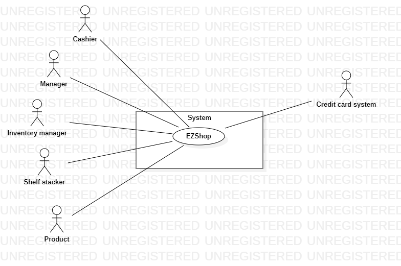

# Requirements Document

Authors: Luca Pezzolla, Teodoro Corbo, Francesco Policastro, Paolo Celada

Date: 3/4/2021

Version: 1.0

# Contents

- [Essential description](#essential-description)
- [Stakeholders](#stakeholders)
- [Context Diagram and interfaces](#context-diagram-and-interfaces)
    + [Context Diagram](#context-diagram)
    + [Interfaces](#interfaces)

- [Stories and personas](#stories-and-personas)
- [Functional and non functional requirements](#functional-and-non-functional-requirements)
    + [Functional Requirements](#functional-requirements)
    + [Non functional requirements](#non-functional-requirements)
- [Use case diagram and use cases](#use-case-diagram-and-use-cases)
    + [Use case diagram](#use-case-diagram)
    + [Use cases](#use-cases)
        + [Relevant scenarios](#relevant-scenarios)
- [Glossary](#glossary)
- [System design](#system-design)
- [Deployment diagram](#deployment-diagram)

# Essential description

Small shops require a simple application to support the owner or manager. A small shop (ex a food shop) occupies 50-200
square meters, sells 500-2000 different item types, has one or a few cash registers EZShop is a software application to:

* manage sales
* manage inventory
* manage customers
* support accounting

We assume that each sale point is composed of hardware (computer with peripherals, barcode reader, printer) plus
software. From now on we will assume POS includes both hardware and software, while EZShop represents only the software
interface.

# Stakeholders

| Stakeholder name  | Description | 
| ----------------- |:-----------:|
|   Owner    |    Owns the shop, makes final decisions regarding investments         | 
|    Manager   |  Handles employees and accounting operations | 
|    Cashier   |  Interact with customers through POS to handle sales | 
|    Inventory manager   |  Handles product refill based on inventory status in EZShop | 
|    Shelf stacker   |  Stacks product refills on shelves, updates product labels through POS | 
|    Customer   |  Buys products interacting with Cashier | 
|    IT administrator   |  Manages all applications in the supermarket | 
|    Security manager   |  Responsible for security issues | 
|    DB administrator   |  Manages DBMSs on which applications are based | 
|    Product   |  Sold goods, interacts with POS through the barcode reader | 
|    Credit card system   |  Handles credit card payments, interacts with POS via internet  | 

# Context Diagram and interfaces

## Context Diagram

## Interfaces

| Actor | Logical Interface | Physical Interface  |
| ------------- |:-------------:| -----:|
|   Cashier     | GUI | Screen, keyboard, mouse |
|   Manager     | GUI |Screen, keyboard, mouse  |
|   Inventory manager     | GUI  | Screen, keyboard, mouse |
|   Shelf stacker     | GUI  | Screen, keyboard, mouse |
|   Product     | bar code | laser beam |
|   Credit card system     | API | internet connection |

# Stories and personas

\<A Persona is a realistic impersonation of an actor. Define here a few personas and describe in plain text how a
persona interacts with the system>

\<Persona is-an-instance-of actor>

\<stories will be formalized later as scenarios in use cases>

# Functional and non functional requirements

## Functional Requirements

| ID        | Description  |
| ------------- |:-------------:| 
|  FR1         | Handle sale |
|  FR1.1       | Start sale |
|  FR1.2       | Add customer fidelity card |
|  FR1.2.1     | Scan customer fidelity card |
|  FR1.2.2     | Apply discount if card points are above threshold |
|  FR1.3       | Add product |
|  FR1.3.1     | Scan or insert product barcode |
|  FR1.3.2     | Retrieve product info & price |
|  FR1.3.2     | Update shopping cart |
|  FR1.4       | Remove product |
|  FR1.4.1     | Scan or insert product barcode |
|  FR1.4.2     | Update shopping cart |
|  FR1.5       | End sale |
|  FR1.5.1     | Consolidate cart content |
|  FR1.5.2     | Choose payment method |
|  FR1.5.3     | Verify successful payment |
|  FR1.5.4     | Update customer fidelity card points |
|  FR1.5.5     | Update inventory |
|  FR2         | Authorize and authenticate  |
|  FR2.1       | Manage accounts |
|  FR2.2       | Log in  |
|  FR2.3       | Log out  |
|  FR3         | Manage inventory | 
|  FR3.1       | Add new product (descriptors,supplier cost, sale price) |
|  FR3.2       | Update inventory quantity | 
|  FR3.3       | Update product sale price |   
|  FR3.4       | Remove product |
|  FR4         | Manage customer | 
|  FR4.1       | Add new customer |
|  FR4.2       | Link fidelity card to customer | 
|  FR4.3       | Unlink fidelity card | 
|  FR4.4       | Update customer data |
|  FR4.5       | Delete customer | 
|  FR5         | Manage accounting | 
|  FR5.1       | Show revenue |  
|  FR5.2       | Show profit |  
|  FR5.3       | Show current inventory value |  

## Non Functional Requirements

\<Describe constraints on functional requirements>

| ID        | Type (efficiency, reliability, ..)           | Description  | Refers to |
| ------------- |:-------------:| :-----:| -----:|
|  NFR1     | Usability | Company users should be able to use EZShop with an introductory training only | All FR |
|  NFR2     | Performance | All functions should complete in < 0.5s | All FR |
|  NFR3     | Correctness  | Sales data should be persisted in case of failures | All FR |
| NFR4      | Security | Prevent unauthorize usage  | All FR | 
| NFR5      | Maintainability | Allow simple integration of new features in the future | All FR | 
| NFR6      | Privacy | Guarantee GDPR compliance | All FR | 
| NFR7      | Availability | Guarantee POS functionality even if the credit card system is not available | All FR | 

# Use case diagram and use cases

## Use case diagram

\<define here UML Use case diagram UCD summarizing all use cases, and their relationships>

\<next describe here each use case in the UCD>

### Use case 1, UC1

| Actors Involved        |  |
| ------------- |:-------------:| 
|  Precondition     | \<Boolean expression, must evaluate to true before the UC can start> |  
|  Post condition     | \<Boolean expression, must evaluate to true after UC is finished> |
|  Nominal Scenario     | \<Textual description of actions executed by the UC> |
|  Variants     | \<other executions, ex in case of errors> |

##### Scenario 1.1

\<describe here scenarios instances of UC1>

\<a scenario is a sequence of steps that corresponds to a particular execution of one use case>

\<a scenario is a more formal description of a story>

\<only relevant scenarios should be described>

| Scenario 1.1 | |
| ------------- |:-------------:| 
|  Precondition     | \<Boolean expression, must evaluate to true before the scenario can start> |
|  Post condition     | \<Boolean expression, must evaluate to true after scenario is finished> |
| Step#        | Description  |
|  1     |  |  
|  2     |  |
|  ...     |  |

##### Scenario 1.2

##### Scenario 1.x

### Use case 2, UC2

..

### Use case x, UCx

..

# Glossary

\<use UML class diagram to define important terms, or concepts in the domain of the system, and their relationships>

\<concepts are used consistently all over the document, ex in use cases, requirements etc>

# System Design

\<describe here system design>

\<must be consistent with Context diagram>

# Deployment Diagram

\<describe here deployment diagram >

